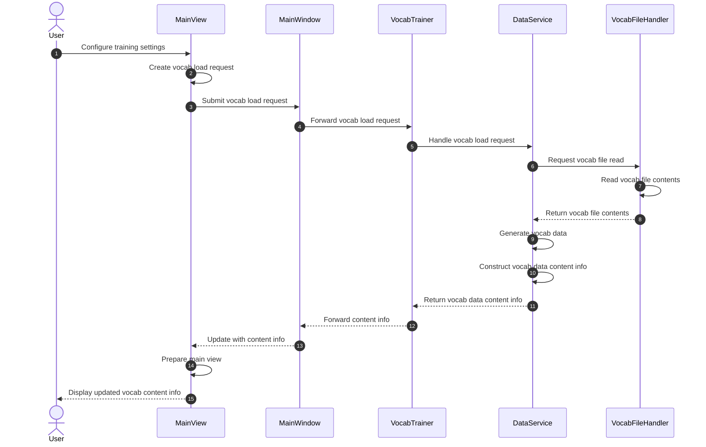

# Vocabulary load

This diagram illustrates the vocabulary load workflow.

```mermaid
sequenceDiagram
    autonumber
    actor USR as User
    participant MV as MainView
    participant MW as MainWindow
    participant VT as VocabTrainer
    participant DS as DataService
    participant VFH as VocabFileHandler

    USR->>MV: Configure training settings
    MV->>MV: Create vocab load request

    MV->>MW: Submit vocab load request
    MW->>VT: Forward vocab load request
    VT->>DS: Handle vocab load request

    DS->>VFH: Request vocab file read
    VFH->>VFH: Read vocab file contents
    VFH-->>DS: Return vocab file contents
    DS->>DS: Generate vocab data
    DS->>DS: Construct vocab data content info

    DS-->>VT: Return vocab data content info
    VT-->>MW: Forward content info
    MW-->>MV: Update with content info
    MV->>MV: Prepare main view

    MV-->>USR: Display updated vocab content info
```