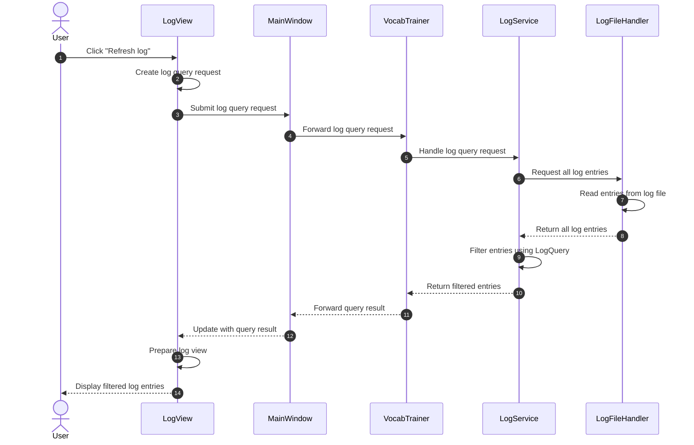

# Log query

This diagram illustrates the log query workflow.

```mermaid
sequenceDiagram
    autonumber
    actor USR as User
    participant LV as LogView
    participant MW as MainWindow
    participant VT as VocabTrainer
    participant LS as LogService
    participant LFH as LogFileHandler
    
    USR->>LV: Click "Refresh log"
    LV->>LV: Create log query request

    LV->>MW: Submit log query request
    MW->>VT: Forward log query request
    VT->>LS: Handle log query request

    LS->>LFH: Request all log entries
    LFH->>LFH: Read entries from log file
    LFH-->>LS: Return all log entries
    LS->>LS: Filter entries using LogQuery

    LS-->>VT: Return filtered entries
    VT-->>MW: Forward query result
    MW-->>LV: Update with query result
    LV->>LV: Prepare log view

    LV-->>USR: Display filtered log entries
```