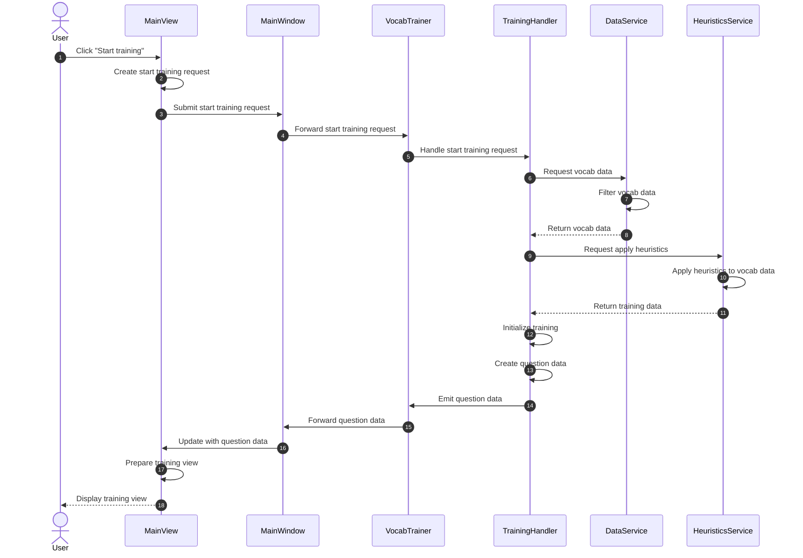
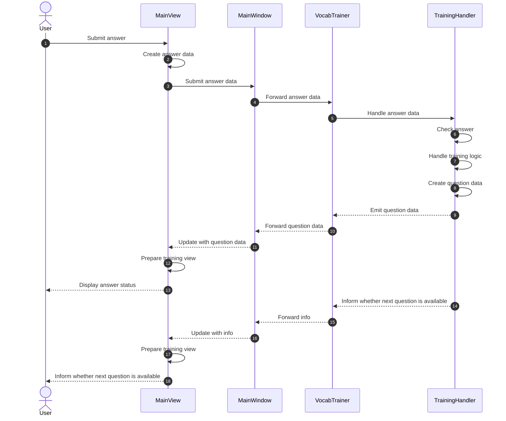
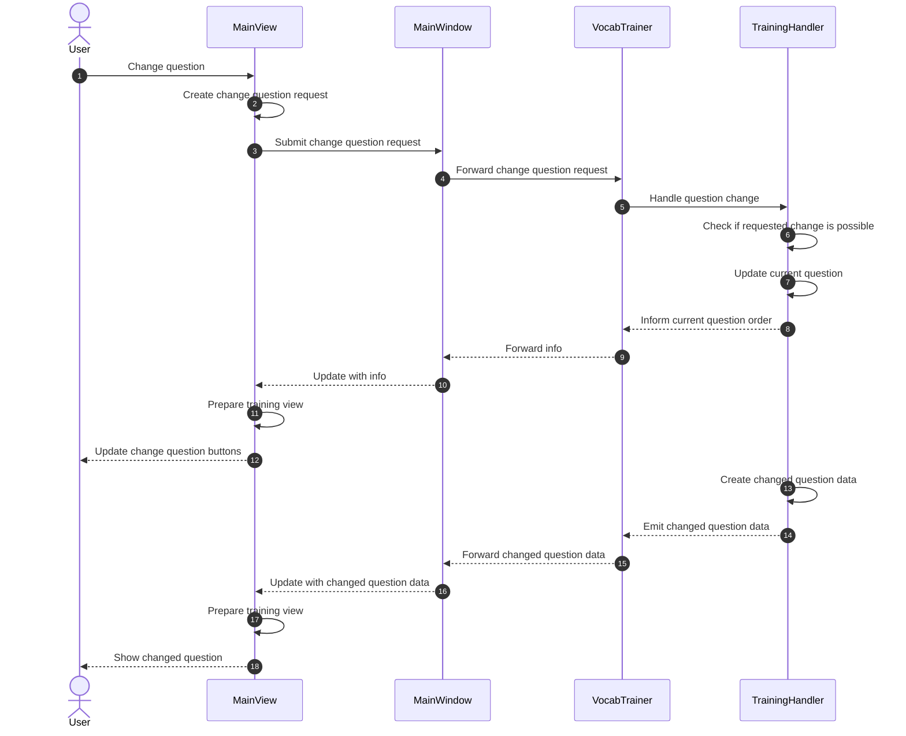
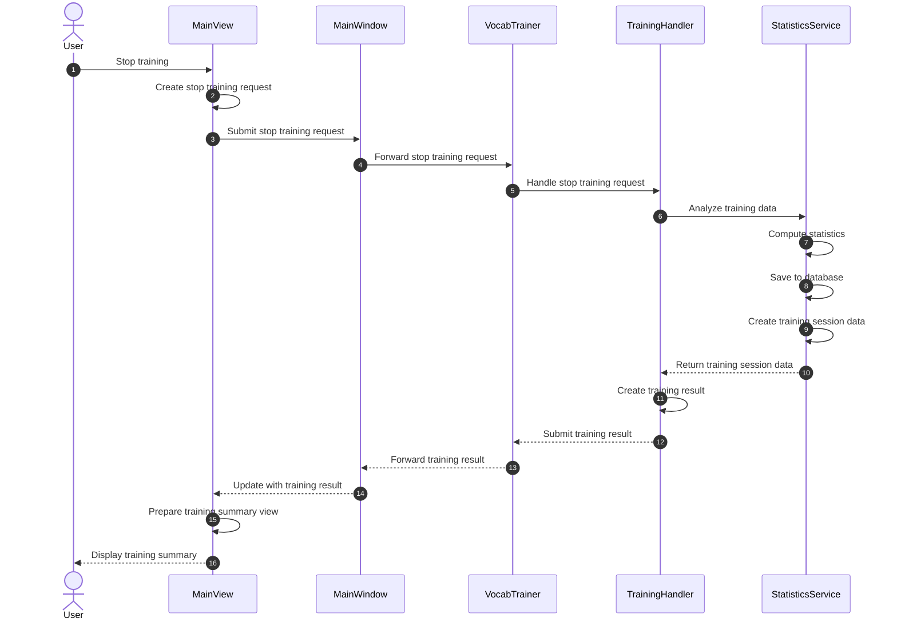

# Training

The below diagrams illustrate the different training workflows.

## Start training

```mermaid
sequenceDiagram
    autonumber
    actor USR as User
    participant MV as MainView
    participant MW as MainWindow
    participant VT as VocabTrainer
    participant TH as TrainingHandler
    participant DS as DataService
    participant HS as HeuristicsService

    USR->>MV: Click "Start training"
    MV->>MV: Create start training request

    MV->>MW: Submit start training request
    MW->>VT: Forward start training request
    VT->>TH: Handle start training request

    TH->>DS: Request vocab data
    DS->>DS: Filter vocab data
    DS-->>TH: Return vocab data

    TH->>HS: Request apply heuristics
    HS->>HS: Apply heuristics to vocab data
    HS-->>TH: Return training data

    TH->>TH: Initialize training

    TH->>TH: Create question data
    TH->>VT: Emit question data
    VT->>MW: Forward question data
    MW->>MV: Update with question data
    MV->>MV: Prepare training view
    MV-->>USR: Display training view
```

## Questions and Answers

```mermaid
sequenceDiagram
    autonumber
    actor USR as User
    participant MV as MainView
    participant MW as MainWindow
    participant VT as VocabTrainer
    participant TH as TrainingHandler

    USR->>MV: Submit answer

    MV->>MV: Create answer data
    MV->>MW: Submit answer data
    MW->>VT: Forward answer data
    VT->>TH: Handle answer data

    TH->>TH: Check answer
    TH->>TH: Handle training logic
    TH->>TH: Create question data

    TH-->>VT: Emit question data
    VT-->>MW: Forward question data
    MW-->>MV: Update with question data
    MV->>MV: Prepare training view

    MV-->>USR: Display answer status

    TH-->>VT: Inform whether next question is available
    VT-->>MW: Forward info
    MW-->>MV: Update with info
    MV->>MV: Prepare training view

    MV-->>USR: Inform whether next question is available
```

## Change question

```mermaid
sequenceDiagram
    autonumber
    actor USR as User
    participant MV as MainView
    participant MW as MainWindow
    participant VT as VocabTrainer
    participant TH as TrainingHandler

    USR->>MV: Change question

    MV->>MV: Create change question request
    MV->>MW: Submit change question request
    MW->>VT: Forward change question request
    VT->>TH: Handle question change

    TH->>TH: Check if requested change is possible
    TH->>TH: Update current question
    TH-->>VT: Inform current question order
    VT-->>MW: Forward info
    MW-->>MV: Update with info
    MV->>MV: Prepare training view

    MV-->>USR: Update change question buttons

    TH->>TH: Create changed question data
    TH-->>VT: Emit changed question data
    VT-->>MW: Forward changed question data
    MW-->>MV: Update with changed question data
    MV->>MV: Prepare training view

    MV-->>USR: Show changed question
```

## Stop training

```mermaid
sequenceDiagram
    autonumber
    actor USR as User
    participant MV as MainView
    participant MW as MainWindow
    participant VT as VocabTrainer
    participant TH as TrainingHandler
    participant SS as StatisticsService

    USR->>MV: Stop training

    MV->>MV: Create stop training request
    MV->>MW: Submit stop training request
    MW->>VT: Forward stop training request
    VT->>TH: Handle stop training request

    TH->>SS: Analyze training data
    SS->>SS: Compute statistics
    SS->>SS: Save to database
    SS->>SS: Create training session data
    SS-->>TH: Return training session data

    TH->>TH: Create training result
    TH-->>VT: Submit training result
    VT-->>MW: Forward training result
    MW-->>MV: Update with training result
    MV->>MV: Prepare training summary view

    MV-->>USR: Display training summary 
```